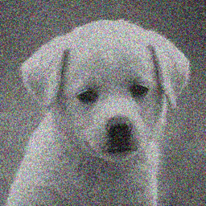
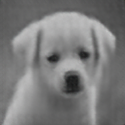
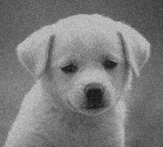

---

# U-Net for Image Denoising in MATLAB

This project implements a U-Net architecture in MATLAB for solving an inverse imaging problem where the forward operator adds noise to the input image. The network is trained to denoise the image, following the ideas from the Deep Image Prior paper by Dmitry Ulyanov.

## Overview

This MATLAB code uses a **U-Net** architecture to remove Gaussian noise from an image. The forward operator simulates real-world noise (e.g., from sensors), and the U-Net is trained as a denoising autoencoder, with noisy images as input and clean images as the ground truth. The architecture follows an encoder-decoder design, with skip connections between corresponding encoder and decoder layers.

### Key Features
- Input image preprocessing to handle both grayscale and RGB images.
- U-Net architecture with adjustable depth and channels.
- Implementation of Gaussian noise addition as the forward operator.
- Option to train the model and visualize the denoised image alongside the noisy image.
- Example training and testing using a single image as a demo.

## Prerequisites

- MATLAB R2024b
- Deep Learning Toolbox

Ensure you have installed the required toolbox with:
```matlab
matlab.addons.install('Deep Learning Toolbox');
```

## Installation

1. Clone or download this repository to your local machine.
    ```bash
    git clone https://github.com/yourusername/unet-image-denoising
    ```
2. Open MATLAB and navigate to the project directory.

## Usage

### Step 1: Input Image

You can use any image for this task, but for demonstration, the provided code loads an image from a local directory. Replace the file path in the following line with the path to your own image:
```matlab
inputImage = imread('C:\Users\razar\Documents\MATLAB\random.jpg');
```

### Step 2: Running the Code

Once you have set up the image path, run the `Inverse_Imaging_Problem_Solution.m` script. The code will:

1. Load and preprocess the image.
2. Add Gaussian noise to the image to simulate the forward operator.
3. Define the U-Net architecture.
4. Train the network using the noisy image as input and the original image as the ground truth.
5. Display the noisy image and the denoised result side by side.


### Step 3: Training Options

You can adjust the training options in the script. For example, modify the number of epochs, the learning rate, and the batch size as needed:
```matlab
options = trainingOptions('adam', ...
    'InitialLearnRate', 1e-4, ...
    'MaxEpochs', 1000, ...
    'MiniBatchSize', 16, ...
    'Shuffle', 'every-epoch', ...
    'Plots', 'training-progress', ...
    'Verbose', false);
```

### Step 4: Output

Once the model is trained, the script will display the noisy input image alongside the denoised image in a montage:
```matlab
imshowpair(noisyImage, denoisedImage, 'montage');
title('Noisy Image (Left) vs Denoised Image (Right)');
```

## Customizing the Code

- **Noise Type**: You can change the type of noise applied by modifying the `imnoise` function. For example, to use salt & pepper noise:
    ```matlab
    noisyImage = imnoise(inputImage, 'salt & pepper', 0.02);
    ```

- **Image Size**: The input and output image size is currently set to 256x256 pixels. To use a different image size, adjust the following line in the U-Net architecture:
    ```matlab
    inputSize = [your_height your_width 3]; % Replace with desired dimensions
    ```

## Sample Results

Below is an example result of running the code on a noisy image:

| Noisy Image | Denoised Image | Input Image |
|-------------|----------------|-------------|
|  |  |   |

## Future Work

- Extend the code to handle other types of noise (e.g., Poisson, salt & pepper).
- Test with larger datasets for denoising tasks.

## License

This project is licensed under the MIT License - see the [LICENSE](LICENSE) file for details.

## Acknowledgments

- Based on the ideas from the Deep Image Prior paper by Dmitry Ulyanov et al.
- MATLAB U-Net architecture inspired by various tutorials on image segmentation and denoising.

---
